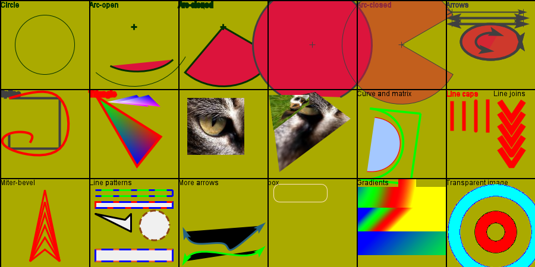
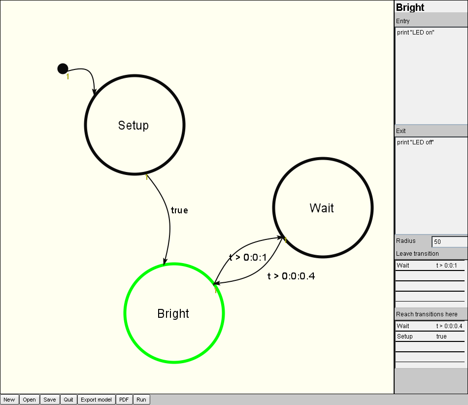

# pdf-export Library for exporting view faces to pdf

## Examples

### Single face with draw commands

[File generated with face-to-pdf](doc/images/geometries-II.pdf)

### Subfaces with some draw commands
 
Results in the [PDF file](doc/images/sm-compiler-example.pdf).


## Usage
### Quick start
Create the face to export
```
view vface: layout [
    h1 "Export this"
    bo: box 200x200 effect [
	draw [
	    pen black line-width 3
	    circle 100x100 75
	]
    ]
]
```
Load the library
`lib: do %face-to-pdf-lib.r`

Export to pdf
```
write %vface.pdf lib/face-to-pdf vface
```
You can export any face such as `bo` in the example.

Writing more than one page is not yet implemented.

## Alternative loading
An alternative way of loading only the main interface function `face-to-pdf`
```do/args %face-to-pdf-lib.r 'face-to-pdf```
Thereafter processing can be done as

```write %vface.pdf face-to-pdf vface```

## Exceptions, known bugs

* `face/pane` as functions are not implemented.

### File related
* Only PDF standard fonts are used.

  There is a conversion table in `face-to-pdf-lib/font-translations` that can be used to
  translate the font used in view int the correpsonding pdf font.
* Each PDF file only contain one page with one face.
* The size of the PDF is set to the size of the face.
* No compression is done, so large images will result in large files.

### Effects related
* None of the image processing commands (`invert`, `luma`, `contrast` ... ) are implemented.
* Tiling is not implemented.
* `merge`, `clip` and `crop` are not implemented.
* The gradient commands `gradcol` and `gradmul` are not implemented.  `gradient` is.
* Algorithmic shapes related commands `cross`, `oval` and `round` are not implemented.
* `shadow` is not implemented. (partly becauyse I cannot figure out what it does).

### Draw related
* When using draw without setting a drawing color, REBOL automatically chooses some color different from 
  the background.  I have put some effort to find what transformation it does without success.
* The draw pen cannot be an image
* Images can have linear transformations, so the general method of setting all four corners of an image
  uses the first three corners and makes an affine transformation of the whole image.
* Spline not implemented
* Nothing from  Shape subdialect is implemented

### Standard compliance
* When resulting pdf file is checked with [veraPDF](http://veraPDF.org) a few
  warnings/errors are detected. However, none seemingly critical.


## File overview

The library is contained in mainly two files.  `pdf-lib.r` and `face-to-pdf-lib.r` where
the latter calls the former.
`pdf-lib.r` is for handling the pdf structure, creating objects, keeping track of their relations .. 
`face-to-pdf.r` extracts the information from view and is responsible for filling the structure given
by `pdf-lib.r`.

Test files are found under `test` directory. Simply execute them from a rebol prompt and they should 
show some graphics and leave a pdf file.


## External libraries used
  * `printf.r` from the rebol script library. Thanks to Jamie and Ladislav.

